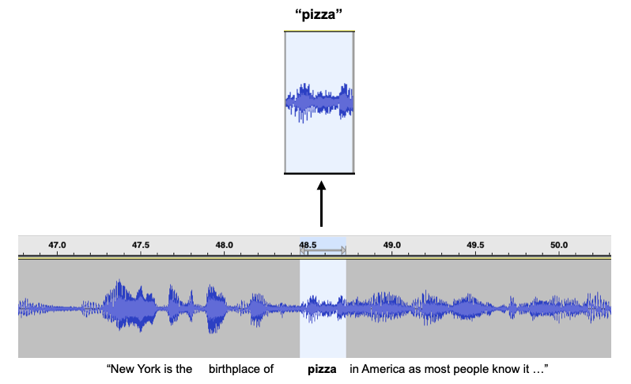

# Audio Keyword Collector

This is a tool to extract spoken word utterances from audio, and preprocess the clips to prepare them for machine learning algorithms.  The tool can collect utterances from YouTube videos or local WAV files.



It utilizes [Mozilla DeepSpeech](https://github.com/mozilla/DeepSpeech) speech-to-text models to identify spoken words.  This model is used instead of other popular STT engines due to it being open source, allowing an unlimited duration of audio to be analyzed at no cost.


# Features

* Extracts and exports keyword utterances from long-form audio
* Automatically resamples downloaded audio and converts to 1-channel
* Saves all utterances or only specified keywords.
* Allows for custom search queries to find relevant audio on YouTube

# Setup

### Clone repository:
```bash
git clone https://github.com/c-jg/keyword-collector.git
```

### Create virtual environment and install dependencies:
```
python -m venv venv3
source venv3/bin/activate
pip install -r requirements.txt
```

*If you want to extract keywords from YouTube videos, you will need to create an environment variable named `YT_API_KEY` that contains your API key for the [YouTube Data API](https://developers.google.com/youtube/v3/getting-started)*

*You may also need to install the following packages on Linux:*
```
sudo apt install libsndfile1
sudo apt install ffmpeg
```

### Download trained [DeepSpeech](https://github.com/mozilla/DeepSpeech) models: (~1.1 GB)
```
curl -LO https://github.com/mozilla/DeepSpeech/releases/download/v0.9.3/deepspeech-0.9.3-models.pbmm
curl -LO https://github.com/mozilla/DeepSpeech/releases/download/v0.9.3/deepspeech-0.9.3-models.scorer

```

### Run application:
```bash
python main.py
```

